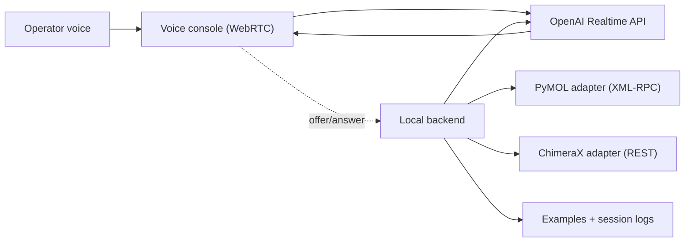

# BioVoice

**Speak to PyMOL and ChimeraX.** Say *"color by confidence and zoom the uncertain loop"* and it happens.

[](LICENSE)
[](https://nodejs.org/)
[](https://www.typescriptlang.org/)


BioVoice is a real-time voice interface for structural biology visualization. It connects [PyMOL](https://pymol.org/) and [ChimeraX](https://www.cgl.ucsf.edu/chimerax/) to the [OpenAI Realtime API](https://platform.openai.com/docs/guides/realtime) via WebRTC, letting you control molecular visualization hands-free with natural language.


## Why?

- **Voice is faster than typing** during live presentations, teaching, and collaborative analysis
- **AlphaFold and Rosetta outputs need interactive exploration** — voice frees your hands for the mouse while you narrate
- **No command syntax to memorize** — just describe what you want in plain English

## Features

- Real-time voice control via **WebRTC** (sub-second latency)
- **18 curated demo workflows** — 9 for PyMOL, 9 for ChimeraX
- **AlphaFold** confidence review, prediction-vs-experiment overlays, multimer triage
- **Rosetta** design comparison, interface packing, scaffold-vs-design overlays
- **Cryo-EM** map cutaways, density contouring, atomic handoffs
- Structured semantic tool dispatch (not just text-to-command piping)
- Push-to-talk and always-on voice modes
- **Floating companion widget** — always-on-top control surface for presentations
- 200+ curated voice utterances for demos and rehearsal
- Dark/light theme, live session usage tracking
- Offline rehearsal mode (no API key needed for dry runs)

<p align="center">
  
</p>

## Requirements

> **macOS only.** The autolaunch system uses `/Applications` and macOS-specific process management. Linux and Windows support is planned but not yet implemented. If you are on Linux/Windows, you can still run the server and web UI — but you will need to start PyMOL/ChimeraX manually.

| Requirement | Notes |
|---|---|
| **macOS** | Required for autolaunch. See note above for other platforms. |
| **Node.js 20+** | Required for the local backend and build system. |
| **curl** | Used by `npm run prepare:data` to download demo structure files. Pre-installed on macOS. |
| **OpenAI API key** | With [Realtime API](https://platform.openai.com/docs/guides/realtime) access. Not needed for offline rehearsal mode. |
| **PyMOL** and/or **ChimeraX** | PyMOL needs RPC mode (`pymol -R`). Both the [open-source](https://github.com/schrodinger/pymol-open-source) and commercial builds support `-R`. ChimeraX needs REST control enabled. |

## Quick Start

```bash
# 1. Install dependencies
npm install

# 2. Configure environment
cp .env.example .env
# Edit .env and set OPENAI_API_KEY

# 3. Pull demo structure files (PDB/CIF from RCSB and AlphaFold DB)
npm run prepare:data

# 4. Generate example docs and prompt packs
npm run generate:examples

# 5. Launch with PyMOL or ChimeraX
npm run quickstart:pymol
# or
npm run quickstart:chimerax
```

The quickstart command builds the app, launches PyMOL/ChimeraX (if installed at `/Applications`), starts the local server, and opens the voice console at `http://localhost:3000`.

### Try Without Voice (No API Key Needed)

You can evaluate the UI, run recipe dry runs, and use the REST API without an OpenAI key:

```bash
npm run agent:start -- pymol --offline --clean-target
```

This starts the server and opens the console in offline mode. Recipes can be dry-run from the Workflows tab or via the API:

```bash
curl -s http://localhost:3000/api/recipes/pymol-binding-pocket-story/run \
  -H 'content-type: application/json' -d '{"target":"pymol"}' | jq
```

### First Voice Test

1. Click **Connect Voice Session** in the console
2. Wait for the `Data`, `Controller`, and `Event Stream` indicators to turn green
3. Stay in **Push-to-Talk** mode for your first session
4. Pick a recipe from Quick Workflows and speak the first Voice Pack line
5. Then switch to freestyle: *"Show as cartoon"*, *"Color chain A blue"*, *"Measure the distance between the catalytic residues"*

## Demo Workflows

### PyMOL

| Recipe | What it does |
|---|---|
| `pymol-binding-pocket-story` | Ligand pocket walkthrough with measurements, labels, surface, and hero export |
| `pymol-two-structure-comparison` | Open/closed adenylate kinase comparison with alignment and lid close-up |
| `pymol-map-and-model-walkthrough` | Gaussian map, density contouring, clipping, and site-focused scenes |
| `pymol-surface-and-presentation` | Surface + cartoon presentation pass with chain labels and export |
| `pymol-selection-and-storyboarding` | Named selections and storyboard scene playback |
| `pymol-alphafold-confidence-sweep` | Confidence coloring, uncertain-loop close-ups, and export |
| `pymol-alphafold-experimental-overlay` | AlphaFold vs. experimental hemoglobin overlay with assembly context |
| `pymol-crystal-packing-contacts` | Symmetry-mate expansion with crystal-packing shell export |
| `pymol-cryo-atomic-handoff` | Cryo-EM map + model, heme-centered density cutaway, and export |

### ChimeraX

| Recipe | What it does |
|---|---|
| `chimerax-ligand-interaction-explainer` | Pocket surface, H-bond and clash analysis |
| `chimerax-homolog-alignment-showcase` | Matchmaker alignment, tiled comparisons, and export |
| `chimerax-alphafold-confidence-review` | Confidence coloring, flexible-loop inspection, and export |
| `chimerax-alphafold-experimental-overlay` | AlphaFold vs. experimental hemoglobin with named views and export |
| `chimerax-biological-assembly-tour` | Biological assembly expansion with named cameras |
| `chimerax-assembly-interface-handoff` | Assembly overview into interface-focused contact analysis |
| `chimerax-em-map-fit-demo` | Real cryo-EM map fit with mesh, orthoplanes, and metrics |
| `chimerax-groel-cavity-tour` | Large-assembly GroEL with domain coloring and cavity cutaway |
| `chimerax-interface-contacts-analysis` | Chain-interface isolation, contacts, hbonds, and export |

## Architecture



The browser posts SDP directly to OpenAI with an ephemeral client secret. The backend owns the sideband controller, tool registration, tool execution, transcripts, and session control. Audio stays browser-to-OpenAI; tool calls flow through the local backend to PyMOL/ChimeraX.

## Project Structure

```
apps/voice-console/          React frontend + Express backend
packages/runtime-and-adapters/  Shared schemas, adapters, prompts, recipe library
scripts/                     CLI tools (startup, rehearsal, data fetch, smoke tests)
tests/                       Unit and integration tests
examples/                    Generated docs, prompt packs, recipe checklists
```

## Startup Commands

| Command | What it does |
|---|---|
| `npm run quickstart:pymol` | Build, launch PyMOL, open console |
| `npm run quickstart:chimerax` | Build, launch ChimeraX, open console |
| `npm run overlay:pymol` | Same, but opens the floating companion widget |
| `npm run overlay:chimerax` | Same, but opens the floating companion widget |
| `npm run dev` | Contributor dev mode (Vite HMR on port 5173) |
| `npm run agent:start -- pymol` | Agent-driven startup with runtime state tracking |
| `npm run agent:start -- pymol --offline` | Start without an API key (rehearsal only) |
| `npm run rehearse:workflow -- <recipeId> --target pymol` | Run a recipe without voice |
| `npm run agent:status` | Check if the managed runtime is running |
| `npm run agent:stop` | Stop the managed runtime |

### Scientific Workflow Launches

Launch AlphaFold or Rosetta tasks directly:

```bash
npm run agent:start -- pymol --workflow alphafold_confidence_review --uniprot P12345
npm run agent:start -- chimerax --workflow rosetta_top_design_compare --bundle ./designs --scorefile ./score.sc --top-n 5
```

Pair `--workflow` with `--uniprot`, `--model`, `--experimental`, `--pae`, `--map`, `--bundle`, `--scorefile`, or `--top-n` as needed.

## Configuration

All configuration lives in `.env`. See [`.env.example`](./.env.example) for the full list with defaults.

Key variables:

| Variable | Default | Purpose |
|---|---|---|
| `OPENAI_API_KEY` | *(required)* | OpenAI API key with Realtime access |
| `DEFAULT_TARGET` | `pymol` | Which app to control (`pymol` or `chimerax`) |
| `PORT` | `3000` | Server port |
| `HOST` | `127.0.0.1` | Bind address. Keep localhost by default. |
| `ALLOW_REMOTE_CLIENTS` | `false` | Explicit opt-in for LAN/browser access beyond localhost |
| `REMOTE_ACCESS_TOKEN` | *(generated if empty)* | Required remote access token for non-local browsers |
| `LOCAL_BROWSER_ORIGINS` | *(empty)* | Additional trusted browser origins for intentional LAN use |
| `ENABLE_AUTOLAUNCH` | `true` | Auto-start PyMOL/ChimeraX if not running |
| `REALTIME_MODEL` | `gpt-realtime-1.5` | OpenAI Realtime model |
| `REALTIME_VOICE` | `marin` | Voice preset |
| `ENABLE_EXPERT_RAW_COMMANDS` | `false` | Enable raw command escape hatch |

If you intentionally run BioVoice from another machine on your LAN, set `HOST=0.0.0.0`, `ALLOW_REMOTE_CLIENTS=true`, `PUBLIC_BASE_URL` to the reachable server URL, and optionally `REMOTE_ACCESS_TOKEN` to a token you control. BioVoice will otherwise generate one at startup and print a launch URL like `http://host:3000/?access_token=...`. `LOCAL_BROWSER_ORIGINS` now limits which browser origins may make cross-origin requests after that remote access token has been presented.

## Verification

```bash
npm run typecheck        # TypeScript strict mode
npm test                 # Unit tests
npm run release:check    # Tracked-file release hygiene + secret scan
npm run build            # Full production build
npm run check            # All of the above

# Health check (when server is running)
curl -s http://localhost:3000/api/health | jq '.appId, .serverMode, .pid'
```

## Voice Control Patterns

BioVoice understands natural-language structural biology commands:

- **Assembly**: *"Rotate the whole complex 30 degrees"*, *"Pull the prediction to the right"*
- **AlphaFold**: *"Color by confidence"*, *"Zoom the low-confidence loop"*, *"Compare to experimental"*
- **Rosetta**: *"Show the redesigned shell"*, *"Pull the design away for before-versus-after"*
- **Cryo-EM**: *"Show density as mesh"*, *"Clip to the active site"*, *"Save a hero export"*
- **Measurements**: *"Measure the distance between the catalytic residues"*
- **Exports**: *"Save a PNG of this view"*, *"Export at high resolution"*

For best results, name your loaded structures descriptively (`exp_complex`, `af_prediction`, `wt_scaffold`, `binder_model`, `density_map`) so voice commands resolve correctly.

## API Endpoints

The local server exposes REST endpoints for programmatic control without voice:

```bash
# Run a recipe
curl -s http://localhost:3000/api/recipes/pymol-cryo-atomic-handoff/run \
  -H 'content-type: application/json' -d '{"target":"pymol"}' | jq

# Capture the current viewport
curl -s http://localhost:3000/api/capture \
  -H 'content-type: application/json' -d '{"target":"chimerax"}' | jq

# Execute arbitrary structured actions
curl -s http://localhost:3000/api/actions \
  -H 'content-type: application/json' \
  -d '{"target":"pymol","actions":[{"type":"reset_workspace"}]}' | jq
```

<details>
<summary><strong>Operator Notes</strong></summary>

- Default mode is **push to talk**. **Always on** switches to `semantic_vad`.
- The UI is ready for voice when `Data`, `Controller`, and `Event Stream` all show green.
- `Realtime Key` and `Usage Key` in the UI indicate env presence only, not that credentials are verified.
- Realtime billing is per response and input-transcription turn, not for keeping the connection open. Idle silence is not billed. Open-mic or VAD can still create billable turns from ambient speech.
- For a first live test, prefer push-to-talk, speak the first Voice Pack line before freestyle, and leave idle auto-sleep enabled.
- The rehearsal panel is first-class: use `Dry Run`, `Reset Target`, and `Capture Current View` before live voice.
- Tool results can include metrics (distances, angles, RMSD, map-fit scores). Reuse those exact numbers instead of paraphrasing.
- `capture_view` saves a viewport image and can feed it back into the conversation for visual verification.
- Raw commands exist as an escape hatch but the model prefers structured actions.
- Run `npm run cleanup:runtime` to prune stale exports, captures, transcripts, and logs before sharing the workspace or filing public issues.

</details>

<details>
<summary><strong>Agent Integration</strong></summary>

AI coding agents (Claude Code, Codex, etc.) can use the structured startup commands:

```bash
npm run agent:start -- pymol
npm run agent:start -- chimerax --overlay
npm run agent:start -- pymol --workflow alphafold_confidence_review --uniprot P12345
npm run agent:status
npm run agent:stop
```

The managed runtime writes state to `.runtime/agent-runtime/state.json`, so agents can reattach to the same PyMOL/ChimeraX session after restarts.

`get_target_state` returns semantic `referenceHints` (`wholeComplex`, `experimentalModel`, `predictedModel`, `scaffoldModel`, `binderModel`, `map`, plus chain-aware handles like `scaffoldChainA`, `designChainA`, `partnerA`, `partnerB`). Use these selectors directly when voice requests reference scene objects.

See [AGENTS.md](./AGENTS.md) for full agent workflow documentation.

</details>

<details>
<summary><strong>Semantic Naming Guide</strong></summary>

When loading structures, descriptive names make voice resolution more reliable:

| Name | Use for |
|---|---|
| `exp_complex` | Experimental crystal/cryo structure |
| `af_prediction` | AlphaFold prediction |
| `wt_scaffold` | Wild-type scaffold |
| `rosetta_design_v2` | Rosetta design output |
| `binder_model` | Binder/ligand model |
| `density_map` | Cryo-EM density map |

This lets requests like *"hide the binder and center on the scaffold"* or *"compare the prediction to the experimental backbone"* resolve to the correct objects.

</details>

## Privacy and Data

BioVoice runs entirely on your machine. Here is exactly what leaves it:

| Data | Sent to OpenAI? | Stored locally? |
|---|---|---|
| Voice audio (your speech) | Yes — via WebRTC to OpenAI Realtime API | No (unless `PERSIST_SESSION_EVENT_LOGS=true`) |
| Transcripts (what you said) | Yes — OpenAI transcribes your audio | Optionally, in `.runtime/sessions/` |
| Tool call parameters (residue names, chain IDs, file paths) | Yes — as part of the Realtime conversation | Optionally, in session event logs |
| **PDB/CIF file contents** | **No** — structure data is read locally by PyMOL/ChimeraX | On your disk only |
| **Cryo-EM maps** | **No** | On your disk only |
| Screenshots / exports | **No** | In `.runtime/exports/` or `output/` |

Your structure files never leave your machine. Only voice audio, transcripts, and structured command parameters (such as residue names and file paths) are included in OpenAI API calls.

Run `npm run cleanup:runtime` to prune session logs, transcripts, and cached exports before sharing your machine or filing public issues.

## Cost

The OpenAI Realtime API bills per audio input/output token. Idle silence is not billed. A typical 5-minute demo workflow costs roughly $0.50-$2.00 depending on how much you speak and how verbose the model's responses are. Push-to-talk mode is more cost-efficient than always-on.

Check [OpenAI's pricing page](https://openai.com/pricing) for current Realtime API rates. Use `npm run usage:report -- 7` to see your actual costs for the last 7 days.

You can evaluate BioVoice for free using `--offline` mode (see [Try Without Voice](#try-without-voice-no-api-key-needed) above).

## Known Limitations

- **macOS only** — autolaunch targets `/Applications`. Linux/Windows users can run the server manually but must start PyMOL/ChimeraX themselves.
- Realtime sessions require microphone permissions and a valid `OPENAI_API_KEY`.
- PyMOL XML-RPC is functional but less structured than ChimeraX REST.
- Custom recipe creation currently requires editing source code (see [CONTRIBUTING.md](./CONTRIBUTING.md)).

## Contributing

Contributions are welcome! See [CONTRIBUTING.md](./CONTRIBUTING.md) for development setup and guidelines.

## Citation

If you use BioVoice in your research, please cite it:

```bibtex
@software{biovoice,
  title = {BioVoice: Real-time voice control for molecular visualization},
  author = {Vogan, Jacob},
  year = {2026},
  url = {https://github.com/jvogan/biovoice}
}
```

## License

[MIT](./LICENSE)
