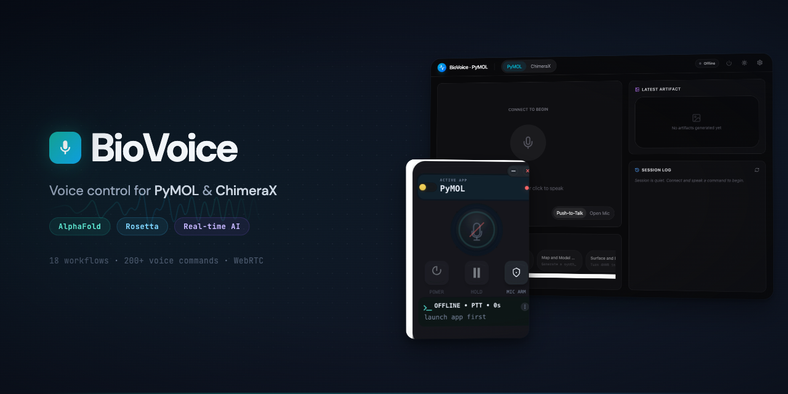
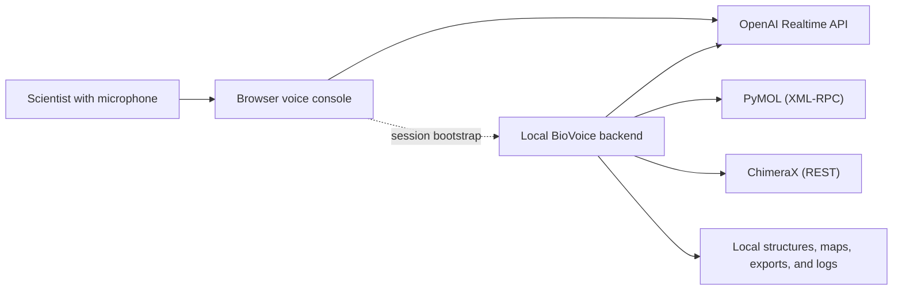

# BioVoice

**Speak to PyMOL and ChimeraX in plain English.** BioVoice is a local voice-control interface for structural biology visualization, built for demos, teaching, and exploratory molecular workflows. It is being released publicly as a **research prototype**: usable today, actively improving, and explicit about what is and is not supported yet.

[](LICENSE)
[](https://nodejs.org/)
[](https://www.typescriptlang.org/)


BioVoice connects [PyMOL](https://pymol.org/) and [ChimeraX](https://www.cgl.ucsf.edu/chimerax/) to the [OpenAI Realtime API](https://platform.openai.com/docs/guides/realtime) through a local backend and a browser voice console. It can also rehearse the same workflows without live voice, so you can validate demos, AlphaFold overlays, Rosetta reviews, and cryo-EM scenes before speaking a word.



> BioVoice supports **OpenAI Realtime only** for live voice today. There is no interchangeable provider UI, Anthropic live voice path, Gemini live voice path, or local/offline speech stack yet.

## What BioVoice Is

- A **local** voice interface for PyMOL and ChimeraX, not a cloud molecular viewer
- A scientist-first workflow tool for **structural biology**, not a general-purpose chatbot shell
- A guided way to walk through **ligand pockets, AlphaFold, Rosetta, and cryo-EM** workflows with reproducible demo data
- A browser UI plus local backend that can run in **live voice** mode or **offline rehearsal** mode

## Who This Is For

- Structural biologists who want to narrate molecular scenes without memorizing command syntax
- Presenters and educators who need hands-free control while teaching or screen-sharing
- AlphaFold users who want confidence, overlay, and handoff walkthroughs
- Rosetta users who want scaffold-versus-design and interface-focused reviews
- Contributors who want a typed, structured tool surface instead of raw command prompting

## Current Support

| Area | Supported today |
|---|---|
| Platform | macOS autolaunch for PyMOL and ChimeraX |
| Linux / Windows | Local server and browser UI can run, but you must start PyMOL / ChimeraX manually |
| Live voice provider | **OpenAI Realtime API only** |
| Voice transport | WebRTC from the browser |
| Input modes | Push-to-talk and always-on |
| Rehearsal mode | Yes, local and offline |
| Scientific workflows | AlphaFold, Rosetta, cryo-EM, ligand pocket, comparison, assembly |

BioVoice ships with conservative Realtime guardrails by default: idle disconnects, a session-duration cap, response and transcription caps, a billable-token cap that triggers warnings before the session is disconnected, and a small concurrent-session cap to stop runaway reconnect churn.

## Quick Start

```bash
# 1. Install dependencies
npm install

# 2. Pull the local demo data
npm run prepare:data

# 3. Generate the examples library and prompt packs
npm run generate:examples

# 4. Optional: configure live voice
cp .env.example .env
# Add OPENAI_API_KEY only if you want live voice

# 5. Launch a local session
npm run quickstart:pymol
# or
npm run quickstart:chimerax
```

If you only want to rehearse without live voice, skip the `.env` step and start with:

```bash
npm run agent:start -- pymol --offline --clean-target
```

## Choose Your Path

- **Try it without voice first**: [Getting Started](./docs/getting-started.md)
- **Run a first live voice session**: [First Live Session](./docs/first-live-session.md)
- **Start with AlphaFold**: [AlphaFold Tutorial](./docs/tutorial-alphafold.md)
- **Start with Rosetta**: [Rosetta Tutorial](./docs/tutorial-rosetta.md)

Additional guided docs:

- [Docs Hub](./docs/README.md)
- [Ligand Pocket Tutorial](./docs/tutorial-ligand-pocket.md)
- [Cryo-EM Tutorial](./docs/tutorial-cryo-em.md)
- [Architecture and Provider Support](./docs/architecture.md)
- [FAQ and Glossary](./docs/faq.md)
- [Public Release Checklist](./docs/public-release.md)

The generated reference library lives under [examples/](./examples/README.md). If you are brand new, start with the docs above first and use `examples/` as the deeper reference set.

## Best Demos To Run First

| Demo | Why start here | Command |
|---|---|---|
| PyMOL ligand pocket story | Fast, visual, and easy to explain live | `npm run showcase:pymol:pocket` |
| ChimeraX ligand interaction explainer | Great first ChimeraX success case | `npm run showcase:chimerax:pocket` |
| ChimeraX AlphaFold overlay | Strong prediction-versus-experiment story | `npm run showcase:chimerax:overlay` |
| PyMOL Rosetta compare | Best scaffold-versus-design hero shot | `npm run showcase:pymol:rosetta` |
| ChimeraX cryo-EM map review | Best real map and fit-quality walkthrough | `npm run showcase:chimerax:map` |
| PyMOL cryo handoff | Strong atomic-plus-density narrative | `npm run showcase:pymol:cryo` |

## What Leaves Your Machine

BioVoice is designed so the molecular files stay local while live voice uses OpenAI.

| Data | Sent to OpenAI? | Stored locally? |
|---|---|---|
| Voice audio | Yes, via WebRTC during live voice sessions | No, unless you explicitly enable local session-event persistence |
| Transcripts of what you said | Yes, as part of live voice operation | Optionally, under `.runtime/` if persistence is enabled |
| Tool-call text such as residue names, chain IDs, and file-path references | Yes, as part of the model conversation | Optionally, in local session logs |
| PDB / CIF / map file contents | No | Yes, on your machine only |
| Captures and exports | No | Yes, under `.runtime/` or `output/` |

Normal local usage is expected to keep real credentials in `.env`. That file is ignored and stays local. The tracked file [`.env.example`](./.env.example) is a **safe template**, not a secret store.

## Supported Today vs Not Yet

| Category | Supported today | Not supported yet |
|---|---|---|
| Live voice provider | OpenAI Realtime API | Anthropic live voice, Gemini live voice, provider switching |
| Speech stack | Browser mic + OpenAI Realtime + configurable transcription model | Local/offline speech recognition and synthesis |
| Modes | Push-to-talk, always-on, offline rehearsal | Multi-provider voice routing |
| Targets | PyMOL, ChimeraX | Additional visualization targets |
| Platform convenience | macOS autolaunch | First-class Linux / Windows autolaunch |

## How Voice Works Today

- Your browser captures microphone audio
- The browser opens a WebRTC session to **OpenAI Realtime**
- The local backend manages tool registration, tool execution, state, logging, and target control
- PyMOL is controlled through XML-RPC and ChimeraX through REST
- `REALTIME_TRANSCRIPTION_MODEL` is configurable in `.env`
- There is **no alternate live voice provider path today**



For deeper detail, including the privacy boundary and support matrix, see [Architecture and Provider Support](./docs/architecture.md).

## Possible Future Providers

BioVoice may grow toward additional voice backends later, but that is an **architecture direction**, not current compatibility. The current implementation, testing, and documentation all assume **OpenAI Realtime** for live voice.

## Guided Tutorials and Reference Material

- [Getting Started](./docs/getting-started.md): install, prepare demo data, and choose a first workflow
- [First Live Session](./docs/first-live-session.md): safest first mic-enabled walkthrough
- [AlphaFold Tutorial](./docs/tutorial-alphafold.md): overlay and confidence-oriented workflow entry point
- [Rosetta Tutorial](./docs/tutorial-rosetta.md): scaffold-versus-design and interface review entry point
- [Ligand Pocket Tutorial](./docs/tutorial-ligand-pocket.md): first polished presentation workflow
- [Cryo-EM Tutorial](./docs/tutorial-cryo-em.md): map and model walkthrough
- [Examples Library](./examples/README.md): generated recipe-by-recipe references
- [Scientific Workflows Catalog](./examples/scientific-workflows/README.md): task-first AlphaFold and Rosetta launch guide

## Verification and Non-Voice Testing

```bash
npm run typecheck
npm test
npm run release:check
npm run build
npm run check
npm run verify:examples
npm run verify:showcases
```

Useful direct checks:

```bash
# Health check when the server is running
curl -s http://localhost:3000/api/health | jq '.appId, .serverMode, .pid'

# Run a recipe without voice
curl -s http://localhost:3000/api/recipes/pymol-binding-pocket-story/run \
  -H 'content-type: application/json' -d '{"target":"pymol"}' | jq
```

## Frequently Asked Questions

### What is BioVoice?

BioVoice is a local research prototype that lets you control PyMOL and ChimeraX with natural-language voice commands, guided workflows, and structured tool execution.

### Can I use BioVoice without an OpenAI API key?

Yes. Use offline rehearsal mode to start the server, inspect the UI, dry-run workflows, and run non-voice recipe routes without live voice.

### Which voice provider does BioVoice support today?

OpenAI Realtime only. That is the only validated live voice provider in the codebase and the docs.

### Does BioVoice support Anthropic, Gemini, or local speech providers?

No. Those are not implemented or supported in this release.

### Does my structure data leave my machine?

No. Molecular files stay local. Live voice audio, transcripts, and model-facing tool-call text go to OpenAI when you use live voice.

### Can I use BioVoice on Linux or Windows?

Partially. The server and UI can run, but autolaunch is macOS-specific today, so PyMOL and ChimeraX must be started manually on those platforms.

### What should I try first if I want a polished demo quickly?

Start with the ligand pocket walkthroughs, then move to AlphaFold overlays or Rosetta reviews once the voice flow feels natural.

For more newcomer questions, see the full [FAQ and Glossary](./docs/faq.md).

## Repository Map

```text
apps/voice-console/               React UI, local server, and browser voice session code
packages/runtime-and-adapters/    Adapters, schemas, prompts, recipes, scientific workflows
scripts/                          Startup, rehearsal, verification, and release tooling
tests/                            Unit and integration coverage
examples/                         Generated examples, recipes, prompts, and verification docs
docs/                             Hand-authored newcomer guides and public architecture docs
```

## Community, Support, and Citation

- [SUPPORT.md](./SUPPORT.md) for usage questions, bug-report paths, and privacy-safe reporting
- [SECURITY.md](./SECURITY.md) for vulnerability handling and local-security guidance
- [CONTRIBUTING.md](./CONTRIBUTING.md) for contributor setup and generated-doc expectations
- [CODE_OF_CONDUCT.md](./CODE_OF_CONDUCT.md) for community expectations
- [CITATION.cff](./CITATION.cff) if you use BioVoice in research
- [Public Release Checklist](./docs/public-release.md) for maintainers preparing a public GitHub release

If you use BioVoice in your work, cite it as:

```bibtex
@software{biovoice,
  title = {BioVoice: Real-time voice control for molecular visualization},
  author = {Vogan, Jacob},
  year = {2026},
  url = {https://github.com/jvogan/biovoice}
}
```

## License

[MIT](./LICENSE)
