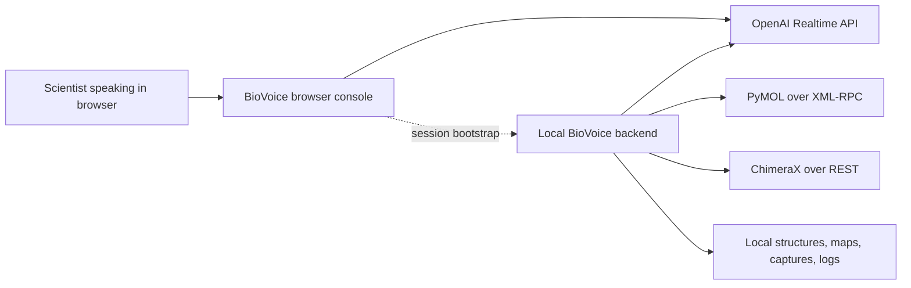
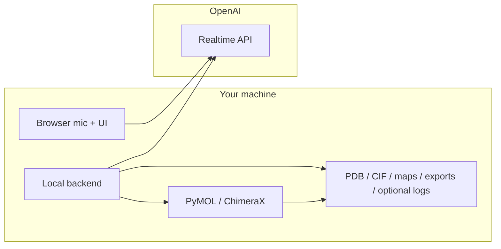

# Architecture and Provider Support

This page explains how BioVoice works today, what is local versus remote, and what the current provider boundaries really are.

## System Architecture

## What Each Piece Does

- **Browser console**: microphone capture, connection controls, workflow selection, session display
- **OpenAI Realtime**: live speech interaction, transcription, and model responses
- **Local BioVoice backend**: tool registration, tool execution, session coordination, logging, policy checks
- **PyMOL / ChimeraX adapters**: structured actions turned into target-specific control calls
- **Local files**: structures, cryo-EM maps, exports, and optional retained session artifacts

## Support Matrix

| Capability | Status today |
|---|---|
| Live voice provider | **OpenAI Realtime API only** |
| Live voice transport | WebRTC |
| Speech input modes | Push-to-talk, always-on |
| Rehearsal mode | Local and offline |
| Tool execution | Local backend to PyMOL / ChimeraX |
| Provider selection UI | Not supported |
| Anthropic live voice | Not supported |
| Gemini live voice | Not supported |
| Local speech recognition / synthesis | Not supported |

## Privacy Boundary

## What Stays Local

- PDB, CIF, and map file contents
- Generated exports and captures
- Runtime state and local logs under `.runtime/` when enabled
- `local/`, `private/`, `tmp/`, and `output/` content
- Your real credentials in local `.env`

## What Goes To OpenAI During Live Voice

- microphone audio
- transcripts
- structured tool-call text, such as residue names, chain IDs, and file-path references
- session instructions and model context needed to drive the live turn

## Current Voice Implementation

BioVoice does not have a generic provider abstraction exposed to the user. The live voice implementation today assumes:

- OpenAI Realtime session setup
- WebRTC browser transport
- local sideband control from the BioVoice backend
- configurable voice and transcription model through `.env`

If you change `REALTIME_MODEL`, `REALTIME_VOICE`, or `REALTIME_TRANSCRIPTION_MODEL`, you are still staying inside the OpenAI Realtime stack.

## Possible Future Providers

The architecture could grow toward additional providers later, but that is only a future direction. BioVoice does **not** currently promise or expose:

- drop-in provider switching
- Anthropic live voice compatibility
- Gemini live voice compatibility
- a local offline speech stack

## Why The App Uses A Local Backend

- to keep molecular file loading local
- to apply path restrictions and guardrails
- to manage a structured tool surface instead of free-form raw commands
- to keep PyMOL and ChimeraX integration stable across rehearsals, demos, and browser reconnects

## Related Docs

- [Getting Started](./getting-started.md)
- [First Live Session](./first-live-session.md)
- [How Tool Calling Works](./realtime-tool-calling.md) — developer-audience deep dive on the Realtime function-tool surface
- [FAQ and Glossary](./faq.md)
- [Security Policy](../SECURITY.md)
