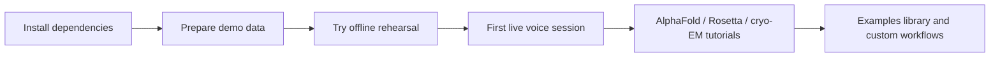
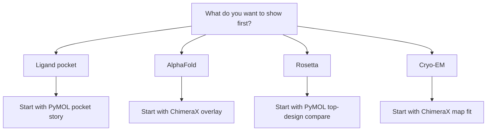

# Getting Started with BioVoice

BioVoice is easiest to learn when you separate three stages: install the local stack, rehearse without voice, then connect your microphone for a live session. This guide is the recommended first stop for public GitHub users.

## What This Guide Covers

- Installing the repo and pulling the validated demo data
- Running the app without voice first
- Choosing the right first workflow for your science story
- Knowing which doc to follow next

## Prerequisites

- macOS for the smoothest autolaunch flow
- Node.js 20+
- PyMOL and/or ChimeraX installed locally
- `curl` available in your shell
- Optional for live voice only: an `OPENAI_API_KEY` with Realtime access

## Install and Prepare the Demo Data

```bash
npm install
npm run prepare:data
npm run generate:examples
```

If you want to use live voice later, create your local env file:

```bash
cp .env.example .env
```

Add `OPENAI_API_KEY` only when you are ready for live voice. Keeping your real credentials in local `.env` is the normal supported setup.

By default, BioVoice only loads structure inputs from the prepared demo-data folder plus local runtime/output folders. If you want it to load private structures from another folder, add that folder to `STRUCTURE_ALLOWED_PATHS` in your local `.env`.

For public database-backed assets, BioVoice can resolve AlphaFold DB, RCSB, EMDB, and UniProt entries through an allowlisted local resolver. Downloaded models, maps, metadata, and manifests live under `.runtime/cache/scientific`.

## Newcomer Journey



## Choose Your First Workflow



## Safest First Run: Try BioVoice Without Voice

This is the best first command if you want to validate the interface, demo data, and local target control before touching microphone permissions or OpenAI billing.

```bash
npm run agent:start -- pymol --offline --clean-target
```

### What You Should Expect To See

- The local server starts on `http://localhost:3000`
- PyMOL launches or reconnects
- The browser opens the BioVoice console
- You can inspect the workflow rail, run dry runs, reset the target, and capture the current view

### If You Prefer ChimeraX First

```bash
npm run agent:start -- chimerax --offline --clean-target
```

## Where To Go Next

- For a first mic-enabled walkthrough: [First Live Session](./first-live-session.md)
- For a polished structural pocket demo: [Ligand Pocket Tutorial](./tutorial-ligand-pocket.md)
- For prediction-versus-experiment: [AlphaFold Tutorial](./tutorial-alphafold.md)
- For design review: [Rosetta Tutorial](./tutorial-rosetta.md)
- For maps and density: [Cryo-EM Tutorial](./tutorial-cryo-em.md)

## Generated Reference Material

These docs are hand-authored. The deeper generated reference set lives here:

- [Examples Library](../examples/README.md)
- [Operator Quick Reference](../examples/start-here/README.md)
- [Scientific Workflows Catalog](../examples/scientific-workflows/README.md)

## Common Failure Points

- **PyMOL or ChimeraX does not start**: make sure the application is installed locally; macOS autolaunch expects standard `/Applications` installs
- **Port 3000 is already in use**: set `PORT` in your local `.env` before starting
- **Demo data is missing**: rerun `npm run prepare:data`
- **You expected voice immediately**: offline rehearsal mode does not use the microphone or OpenAI
- **You are on Linux or Windows**: start PyMOL / ChimeraX manually and then use the same commands

## Where To Go After This

- [First Live Session](./first-live-session.md) to connect a microphone safely
- [Architecture and Provider Support](./architecture.md) to understand the local/privacy model
- [FAQ and Glossary](./faq.md) for platform, privacy, and provider questions
