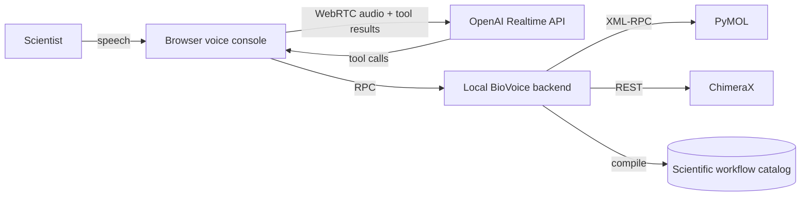

# How Tool Calling Works in BioVoice

This page is the developer-audience deep dive on **how BioVoice wires the OpenAI Realtime API to PyMOL and ChimeraX through structured function tool calls**. If you are building a voice agent, a Realtime API integration, or any LLM tool-calling layer against a complex external application, this is the pattern to copy.

Everything here is real and lives in the repo. File paths are linkable. The tool schemas are authoritative — the model really is called with these definitions, validated through Zod, and routed to live adapters.

## What You Get

BioVoice is a working reference for the full loop of Realtime API tool calling against non-trivial external software:

- **11 Realtime function tools** across the catalog; each live session exposes 10 because only its active target action tool is included
- **10 task-level AlphaFold, Rosetta, and variant workflows** exposed behind a single domain tool
- **Rich JSON Schema selectors** — chain IDs, residue ranges, ligand handles, proximity queries, semantic references
- **Two adapter layers** for PyMOL (XML-RPC) and ChimeraX (REST) driven by the same typed action schema
- **State grounding** — the model can fetch the current scene before deciding what to do next
- **Dry-run mode, idle disconnects, token caps, and a safe-by-default raw-command gate**
- **Offline rehearsal mode** so the whole surface is readable and runnable without an OpenAI key

## Architecture At A Glance



The browser owns the WebRTC session to OpenAI Realtime. The model emits tool calls in the session; the browser relays them to the local backend over HTTP / SSE; the backend validates, executes, and returns a structured result; the browser plays the result back into the live session as a tool response. The model then picks the next action. Nothing in PyMOL or ChimeraX is driven by free text from the model — every action goes through a validated schema.

## The Registered Tools

The registrar is [`buildRealtimeTools()`](../packages/runtime-and-adapters/src/realtime/tool-definitions.ts). It returns a filtered list based on the active target, so the model never sees a PyMOL tool when ChimeraX is active, never sees a ChimeraX tool when PyMOL is active, and never sees the raw-command action when expert mode is off.

| Tool | Purpose |
|---|---|
| `run_pymol_actions` | Execute one or more structured PyMOL visualization actions (load, select, color, measure, align, map, transform, surface, export, scene, ...) |
| `run_chimerax_actions` | Same shape for ChimeraX (open, visibility, style, contacts, matchmaker, volume, view, graphics, ...) |
| `get_target_state` | Fetch the current target's objects, active selections, and semantic reference hints before deciding on an action |
| `resolve_structure_asset` | Resolve/search/cache AlphaFold DB, RCSB, EMDB, and UniProt assets through allowlisted database APIs; optionally load the resolved local file into the active target |
| `run_scientific_workflow` | Run a domain-level AlphaFold, Rosetta, or variant workflow that compiles down to target-specific actions |
| `run_recipe_step` | Execute a named step from the built-in demo library (storyboard-style workflows) |
| `export_artifact` | Save a presentation-ready PNG or session file |
| `undo_last_action` | Restore the target's single most recent local scene checkpoint |
| `capture_view` | Capture the current viewport locally; attach it to the model only after explicit consent and server opt-in |
| `wait_for_user` | End a silence, background-noise, or side-conversation turn quietly without a spoken reply |
| `set_response_language_mode` | Switch the user-facing response-language mode without changing tool JSON or scientific identifiers |

Each tool's full JSON Schema is defined in [`tool-definitions.ts`](../packages/runtime-and-adapters/src/realtime/tool-definitions.ts). Here is the scientific-workflow tool — the one that turns AlphaFold, Rosetta, and residue-variant vocabulary into structured arguments the model can reliably fill in:

```ts
{
  type: "function",
  name: "run_scientific_workflow",
  description:
    "Run a domain-level AlphaFold, Rosetta, or residue-variant workflow and compile it into " +
    "the existing PyMOL or ChimeraX action wrappers. Prefer this for task-level " +
    "requests such as AlphaFold confidence review, prediction-vs-experiment " +
    "overlay, multimer interface triage, PAE-guided uncertainty review, cryo " +
    "handoff, Rosetta scaffold-versus-design review, scorefile-ranked " +
    "top-design compare, interface packing review, ligand redesign review, " +
    "or variant environment review.",
  parameters: {
    type: "object",
    properties: {
      target: { type: "string", enum: ["pymol", "chimerax"] },
      workflow: {
        type: "string",
        enum: [
          "alphafold_confidence_review",
          "alphafold_vs_experiment_overlay",
          "alphafold_multimer_interface_review",
          "alphafold_pae_guided_triage",
          "alphafold_to_cryo_handoff",
          "rosetta_scaffold_design_review",
          "rosetta_interface_packing_review",
          "rosetta_ligand_redesign_review",
          "rosetta_top_design_compare",
          "variant_environment_review",
        ],
      },
      inputs: { oneOf: [alphaFoldInputsSchema, rosettaInputsSchema, variantInputsSchema] },
      presentationMode: { type: "string", enum: ["analysis", "demo", "publication"] },
      export: scientificWorkflowExportSchema,
      dryRun: { type: "boolean" },
      summary: { type: "string" },
      recipeId: { type: "string" },
    },
    required: ["target", "workflow", "inputs"],
    additionalProperties: false,
  },
}
```

## The Selector Pattern: A Reusable Idea

The single most important idea in this repo for other tool-calling implementations is the **polymorphic selector schema**. When a scientist says "color chain A", "zoom to the heme", "show side chains near the ligand within five angstroms", or "focus on the predicted model's binder chain", the model needs a selector that can express all of those cleanly.

The schema is a `oneOf` between a plain string and a structured object:

```ts
const selectorSchema = {
  oneOf: [
    { type: "string", minLength: 1, maxLength: 400 },
    {
      type: "object",
      properties: {
        reference: { type: "string" },              // semantic handle like "predictedModel"
        object: { type: "string" },                 // loaded object name
        chain: { type: "string" },
        chains: { type: "array", items: { type: "string" } },
        residue: { type: "string" },                // numeric IDs only, e.g. "58-87"
        residueName: { type: "string" },            // HEM, ATP, NAD, HIS
        atom: { type: "string" },
        ligand: { type: "string" },                 // cofactor / ligand residue name
        entity: {
          type: "string",
          enum: ["protein", "nucleic", "polymer", "organic",
                 "solvent", "ions", "backbone", "sidechain"],
        },
        around: { type: "string" },                 // e.g. "4hhb and resn HEM"
        withinAngstroms: { type: "number", minimum: 0.5, maximum: 50 },
        byResidue: { type: "boolean" },
      },
      additionalProperties: false,
    },
  ],
} as const;
```

Three details matter if you copy this pattern into your own agent:

1. **`description` strings inside the schema are how you teach the model the domain**. For example, the `residue` field explicitly says *"Numeric residue ID or range only, for example 58, 58-87, or 100A. Do not put ligand/cofactor names here."* That sentence alone prevents a whole class of confusions where the model tries to put `HEM` into `residue`.
2. **`oneOf` with a string fallback** gives the model an escape hatch for unusual cases without making it stuff everything into strings.
3. **Semantic `reference` handles** like `predictedModel`, `experimentalModel`, `scaffoldModel`, `binderChainA`, and `partnerB` are returned by `get_target_state`. When the scientist says "move the predicted model", the model picks `{ reference: "predictedModel" }` and the adapter resolves it to a concrete object name.

## Grounding With `get_target_state`

Most tool-calling failures against mutable external state come from the model inventing object names. BioVoice's fix is a cheap read-only tool the model is nudged to call before acting on ambiguous references:

```ts
{
  type: "function",
  name: "get_target_state",
  description:
    "Fetch the current target's state summary before deciding on the next action, " +
    "especially when the user says 'this', 'that', 'whole complex', 'predicted model', " +
    "'experimental model', 'binder', 'scaffold', 'partner A', 'partner B', or asks what " +
    "is loaded. The result includes referenceHints with concrete selectors for those " +
    "semantic handles.",
  parameters: {
    type: "object",
    properties: { target: { type: "string", enum: ["pymol", "chimerax"] } },
    required: ["target"],
    additionalProperties: false,
  },
}
```

The response contains `referenceHints` like `{ wholeComplex: "4hhb", predictedModel: "af_prediction", scaffoldChainA: "rosetta_scaffold_v1 and chain A" }`, so the next tool call can use a concrete selector instead of guessing. This is a clean, copyable pattern for **any** tool-calling agent that operates on mutable external state — chat over a database, an IDE agent, a browser agent, a scene editor.

## Resolving Known Database Assets

BioVoice now separates "find or fetch the biology asset" from "style the scene". The shared `resolve_structure_asset` tool accepts only known database sources:

| Source | Inputs | Output |
|---|---|---|
| `alphafold` | `uniprotId`, optional `format`, optional `includePae` | Cached PDB/mmCIF model and optional PAE JSON |
| `rcsb` | `pdbId`, optional `format`, optional numeric `assemblyId` | Cached RCSB PDB/mmCIF structure or biological assembly and optional metadata |
| `rcsb_search` | text `query`, optional `limit` | RCSB search results enriched with compact entry metadata, no file load |
| `emdb` | `emdbId`, optional `includeMetadata` | Cached decompressed `.map` file and optional metadata |
| `uniprot` | `accession` or text `query`, optional `limit` | UniProt metadata or search results |

When `loadIntoTarget=true`, the registry translates the resolved file into the same structured `load` / `open` action used by the adapters. Resolved maps also get an immediate visible density mesh: PyMOL receives `map_display`, and ChimeraX receives a `volume mesh` action targeting the just-opened map. This keeps all target safety checks in one place while giving the model a reliable path from "load 4HHB", "fetch the AlphaFold model for P69905", or "open EMDB 1234" to a local cached file.

The resolver does not accept arbitrary URLs. Downloads are limited to allowlisted hosts, capped by asset type, written to `.runtime/cache/scientific`, and described by local manifest files. Scripted callers can hit the same path without live voice:

```bash
curl -s http://localhost:3000/api/assets/resolve \
  -H 'content-type: application/json' \
  -d '{"source":"rcsb","pdbId":"4HHB","format":"pdb","target":"pymol","loadIntoTarget":true,"object":"exp_complex","semanticRole":"experimental"}' | jq
```

## Compiling Domain Concepts Into Tool Calls

Exposing a flat list of every low-level action (select, color, zoom, align, ...) to the model works for simple requests but rots fast on multi-step workflows. BioVoice uses a second pattern: **a domain-level tool (`run_scientific_workflow`) whose enum values are task-sized concepts**. The backend compiles each concept into the low-level action stream.

The workflow catalog lives in [`packages/runtime-and-adapters/src/scientific/catalog.ts`](../packages/runtime-and-adapters/src/scientific/catalog.ts). Each entry has a goal, a category (`alphafold` or `rosetta`), supported apps, starter prompts, and input hints — enough for the model to pick the right workflow, fill in the inputs, and tell the scientist what is about to happen.

The compiler lives in [`packages/runtime-and-adapters/src/scientific/runner.ts`](../packages/runtime-and-adapters/src/scientific/runner.ts). It takes a validated `ScientificWorkflowRequest` and emits the same `ActionEnvelope` the low-level tools produce, so the adapter layer stays single-purpose.

This layering — a small domain tool over a rich action tool over typed adapters — is the move to make when your users speak in task vocabulary but your backend wants atomic actions.

## Dry-Run Mode

Every action-taking tool accepts `dryRun: boolean`. When true, the backend builds the full action stream, validates every envelope, and returns the planned adapter calls **without executing them**. This is how rehearsals work, and it is the foundation for the `npm run rehearse:workflow` CLI.

For agent developers this is also how you build safe preview modes. The model can show the scientist what is about to happen before touching live state.

## Safety And Session Policies

Because the Realtime API keeps an open mic, cost and blast-radius control matter. BioVoice ships conservative defaults:

- **Realtime 2 default**: live sessions default to `gpt-realtime-2` with `REALTIME_REASONING_EFFORT=low`, which keeps the stronger tool-use model responsive for live demos.
- **Hosted prompt hook**: `REALTIME_PROMPT_ID`, `REALTIME_PROMPT_VERSION`, and `REALTIME_PROMPT_VARIABLES_JSON` can attach an OpenAI-hosted Realtime prompt while BioVoice still sends local target tools, instructions, and guardrails as direct session fields.
- **Safety identifier propagation**: `OPENAI_SAFETY_IDENTIFIER` is forwarded as an OpenAI safety identifier during Realtime setup. Use a hashed or synthetic stable identifier, never a raw name, email, API key, or private subject identifier.
- **Raw-command gate**: `raw_command` actions are filtered out of the tool schema unless `ENABLE_EXPERT_RAW_COMMANDS=true` and the client connected in advanced mode. The model literally cannot call raw commands in a default session.
- **Local-first capture gate**: `capture_view` writes locally by default. Conversation attachment also requires `ALLOW_CAPTURE_UPLOADS=true` and a fresh, short-lived, single-use consent grant created by an authenticated user action in the same live session. Setting `attachToConversation` cannot grant consent.
- **One-level undo**: mutating action bundles capture a local PyMOL or ChimeraX session checkpoint before execution. Complete recipes and scientific workflows keep one checkpoint from before the whole run, so one undo restores the scene that existed before any internal step or phase.
- **Run receipts**: completed actions, workflows, exports, and captures produce local receipts with evidence level, artifacts, warnings, and checkpoint availability.
- **Ordered visual actions**: parallel tool calls are disabled for Realtime 2 sessions so molecular scene edits stay serialized through the local backend.
- **Rate-limit visibility**: sideband `rate_limits.updated` events are summarized into the operator event stream so live demos can see remaining request/token budget without enabling raw Realtime event spam.
- **Long-session context pruning**: `REALTIME_CONTEXT_PRUNING=true` tracks Realtime conversation item IDs and sends `conversation.item.delete` for old user, assistant, and tool-result items after `REALTIME_CONTEXT_MAX_ITEMS`, retaining the most recent `REALTIME_CONTEXT_RETAIN_ITEMS`.
- **Idle disconnect** and a **session duration cap** prevent forgotten open mics.
- **Response, transcription, and billable-token caps** emit warnings and then invoke the Realtime call hangup endpoint before the session can run away.
- **Concurrent-session cap** prevents reconnect churn from stacking.
- **Per-tool validation with Zod** before the action ever reaches an adapter — the model cannot send anything the schema doesn't allow.

These live in the session registry and instructions in [`packages/runtime-and-adapters/src/realtime/`](../packages/runtime-and-adapters/src/realtime/) and are baked into the instructions returned by `buildSessionInstructions()`.

## Studying The Pattern Without A Microphone

You do not need a working mic, an OpenAI key, or even a local PyMOL install to study the tool-calling surface.

```bash
# 1. Dependencies only
npm install

# 2. Inspect the tool definitions directly in your editor
$EDITOR packages/runtime-and-adapters/src/realtime/tool-definitions.ts

# 3. Run a workflow through the same schemas the model would hit
npm run agent:start -- pymol --offline --clean-target

# 4. Exercise the recipe endpoint non-interactively
curl -s http://localhost:3000/api/recipes/pymol-binding-pocket-story/run \
  -H 'content-type: application/json' -d '{"target":"pymol"}' | jq

# 5. Rehearse a scientific workflow end-to-end with dry-run
npm run rehearse:workflow -- alphafold_confidence_review --target pymol --capture
```

Rehearsal mode compiles the same workflow the live voice path would compile and runs it through the adapters without a Realtime session, so you can trace every layer in isolation.

## Where The Code Lives

| What | Where |
|---|---|
| Realtime tool definitions | [`packages/runtime-and-adapters/src/realtime/tool-definitions.ts`](../packages/runtime-and-adapters/src/realtime/tool-definitions.ts) |
| Session registry (mic, tool dispatch, session policy) | [`packages/runtime-and-adapters/src/realtime/session-registry.ts`](../packages/runtime-and-adapters/src/realtime/session-registry.ts) |
| Session events (browser-facing stream) | [`packages/runtime-and-adapters/src/realtime/session-events.ts`](../packages/runtime-and-adapters/src/realtime/session-events.ts) |
| Session instructions / system prompts | [`packages/runtime-and-adapters/src/prompts/`](../packages/runtime-and-adapters/src/prompts/) |
| Zod schemas for every action envelope | [`packages/runtime-and-adapters/src/schemas/`](../packages/runtime-and-adapters/src/schemas/) |
| PyMOL adapter (XML-RPC) | [`packages/runtime-and-adapters/src/adapters/pymol-adapter.ts`](../packages/runtime-and-adapters/src/adapters/pymol-adapter.ts) |
| ChimeraX adapter (REST) | [`packages/runtime-and-adapters/src/adapters/chimerax-adapter.ts`](../packages/runtime-and-adapters/src/adapters/chimerax-adapter.ts) |
| Scientific workflow catalog | [`packages/runtime-and-adapters/src/scientific/catalog.ts`](../packages/runtime-and-adapters/src/scientific/catalog.ts) |
| Scientific workflow compiler | [`packages/runtime-and-adapters/src/scientific/runner.ts`](../packages/runtime-and-adapters/src/scientific/runner.ts) |
| Recipe / step catalog | [`packages/runtime-and-adapters/src/examples/library.ts`](../packages/runtime-and-adapters/src/examples/library.ts) |
| Tool playbooks reference | [`examples/tool-playbooks/`](../examples/tool-playbooks/) |
| Browser-side Realtime client | [`apps/voice-console/src/`](../apps/voice-console/src/) |

## Related Reading

- [Architecture and Provider Support](./architecture.md) — local-versus-remote boundary, WebRTC path, privacy matrix
- [First Live Session](./first-live-session.md) — the smallest-possible live voice loop
- [FAQ and Glossary](./faq.md) — newcomer answers
- [Examples Library](../examples/README.md) — recipe-by-recipe reference content
- [Scientific Workflows Catalog](../examples/scientific-workflows/README.md) — task-first launch guide

## Why We Think This Is Useful

If you are shipping a voice agent or a Realtime API integration for any domain — customer support, IDE control, browser automation, a game engine, a DAW, a CRM — the problems you will hit are not the WebRTC handshake. They are:

1. **Designing tool arguments the model can actually fill in reliably** (selector schema + description strings)
2. **Grounding the model in mutable external state** (`get_target_state`)
3. **Turning user vocabulary into structured calls without rotting** (domain tool over action tool over adapter)
4. **Dry-running before executing**
5. **Session guardrails** (timeouts, token caps, concurrency, raw-command gates)

BioVoice solves each of these in a public, readable TypeScript codebase that you can clone, grep, and copy from. That is the part we think is worth open-sourcing even for teams that never touch a protein structure.
